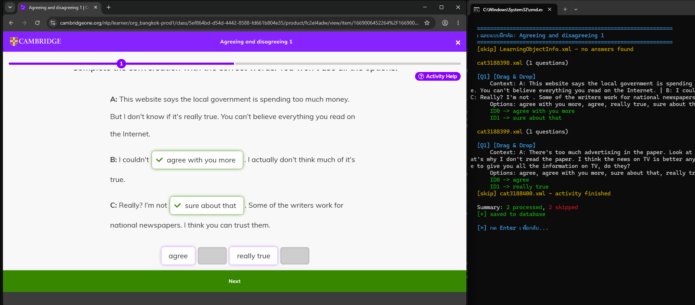

# Cambridge One Answer Extractor

โปรแกรม command-line สำหรับเข้าสู่ระบบ Cambridge One เลือกคอร์สและแบบฝึกหัด แล้วแสดงข้อมูลคำถามและคำตอบที่โปรแกรมอ่านได้

## ตัวอย่างหน้าจอ



> ใช้เฉพาะบัญชีและเนื้อหาที่คุณมีสิทธิ์เข้าถึง และปฏิบัติตามเงื่อนไขการใช้งานของ Cambridge One

## ความสามารถหลัก

- จัดการบัญชี Cambridge One หลายบัญชี และเปิด persistent browser profile แยกตามบัญชีเพื่อเก็บ session
- ตรวจสอบ session ที่มีอยู่ หรือเข้าสู่ระบบผ่านหน้าเว็บ
- แสดงคอร์สที่มี Digital Workbook, Units, Lessons และแบบฝึกหัด พร้อมสถานะที่หน้าเว็บแสดง
- แสดงคำถาม ตัวเลือก คำตอบที่ถูกต้อง และบริบทของแบบฝึกหัดที่รองรับ
- บันทึกผลที่อ่านได้ไว้ในฐานข้อมูล JSON เพื่อเปิดดูภายหลังหรือเลือกใช้ข้อมูลเดิม
- เลือกใช้เมนูภาษาไทยหรืออังกฤษ และบันทึกภาษาที่เลือกไว้
- บันทึกข้อความจากการทำงานลง log แยกตาม session

ผลลัพธ์ขึ้นอยู่กับข้อมูลและรูปแบบของกิจกรรมที่เลือกใน Cambridge One

## ความต้องการ

- Python 3.9 ขึ้นไป
- อินเทอร์เน็ตและบัญชี Cambridge One ที่มีสิทธิ์เข้าถึงคอร์สและแบบฝึกหัด
- Chromium ที่ติดตั้งผ่าน Playwright

## ติดตั้ง

เปิด PowerShell ในโฟลเดอร์โปรเจกต์ แล้วติดตั้ง dependency:

```powershell
py -m venv .venv
.\.venv\Scripts\Activate.ps1
python -m pip install requests colorama playwright
python -m playwright install chromium
```

หาก PowerShell ไม่อนุญาตให้ activate virtual environment ให้เรียก Python จาก environment โดยตรง:

```powershell
.\.venv\Scripts\python.exe -m pip install requests colorama playwright
.\.venv\Scripts\python.exe -m playwright install chromium
```

## เริ่มใช้งาน

รันจากโฟลเดอร์โปรเจกต์ เพื่อให้โปรแกรมอ่านและสร้าง `configs/`, `chrome_data/` และ `logs/` ในตำแหน่งที่ถูกต้อง:

```powershell
python main.py
```

เมนูหลัก:

| ตัวเลือก | การทำงาน |
| --- | --- |
| `1` | เข้าสู่ระบบและเลือกคอร์ส/บท/แบบฝึกหัดเพื่อแสดงคำตอบ |
| `2` | ดูรายการข้อมูลที่บันทึกไว้ และเปิดดูรายละเอียด |
| `3` | เปลี่ยนภาษาไทย/อังกฤษ |
| `4` | ออกจากโปรแกรม |

## ขั้นตอนการใช้งาน

1. เปิด PowerShell ในโฟลเดอร์โปรเจกต์ แล้วรัน `python main.py`.
2. ในเมนูหลัก เลือก `1` เพื่อเริ่มใช้งานส่วนแบบฝึกหัด หากต้องการดูข้อมูลที่เคยบันทึกไว้ ให้เลือก `2`.
3. เลือกบัญชีที่มีอยู่ หรือเลือก `A` เพื่อเพิ่มบัญชีใหม่แล้วกรอกอีเมล
4. โปรแกรมจะเปิดหน้าต่าง Chromium สำหรับบัญชีนั้น หาก session ใช้งานได้ก็ไปต่อได้เลย หากหมดอายุให้กรอกรหัสผ่านในโปรแกรมและดำเนินการเข้าสู่ระบบในหน้าต่างเบราว์เซอร์ หากต้องการให้โปรแกรมจำรหัสผ่าน ให้ตอบ `1` ตอนที่โปรแกรมถาม; ตอบ `0` หากไม่ต้องการบันทึก
5. เมื่อเข้าสู่ระบบแล้ว เลือกคอร์สที่มี Digital Workbook จากรายการ
6. เลือก Unit ที่ต้องการ จากนั้นเลือกแบบฝึกหัดใน Lesson ที่แสดงอยู่
7. หากโปรแกรมพบข้อมูลที่เคยบันทึกของแบบฝึกหัดนั้น จะถามว่าจะใช้ข้อมูลเดิมหรือไม่: เลือก `1` เพื่อเปิดรายการเดิม หากไม่เลือก โปรแกรมจะดำเนินการกับแบบฝึกหัดที่เลือกและแสดงผลที่อ่านได้
8. กด Enter เพื่อกลับไปยังรายการก่อนหน้า เมื่อดูเสร็จแล้วสามารถเลือก `2` จากเมนูหลักเพื่อเปิดดูรายการที่บันทึกไว้ หรือเลือก `4` เพื่อออก

ในหน้ารายการคอร์ส ตัวเลือก `0` ใช้รีเฟรชรายการ และ `X` ใช้ออกจากโปรแกรม ส่วนรายการ Unit และแบบฝึกหัดมีตัวเลือก `0` สำหรับย้อนกลับ

## ไฟล์และข้อมูลในเครื่อง

| ตำแหน่ง | ใช้สำหรับ |
| --- | --- |
| `main.py` | จุดเริ่มต้น เมนู และการทำงานกับ Cambridge One |
| `configs/cambridge_accounts.json` | รายการบัญชี และอาจมีรหัสผ่านที่บันทึกไว้ |
| `configs/answers_db.json` | คำตอบที่อ่านได้ จัดเก็บแยกตามคอร์ส Unit และแบบฝึกหัด |
| `configs/settings.json` | การตั้งค่าภาษา |
| `chrome_data/` | Chromium profile และ session แยกตามบัญชี |
| `logs/` | log ของแต่ละรอบการทำงาน |

โปรแกรมสร้างโฟลเดอร์และไฟล์ config ที่จำเป็นเมื่อเริ่มทำงาน โดยไม่จำเป็นต้องสร้างฐานข้อมูลเปล่าด้วยตนเอง

## ความเป็นส่วนตัว

- รหัสผ่านที่บันทึกไว้ใน `configs/cambridge_accounts.json` ถูกเก็บเป็นข้อความธรรมดา ไม่ใช่ password manager ที่เข้ารหัส อย่าแชร์ไฟล์นี้ และลบรหัสผ่านออกจากไฟล์หลังใช้งานหากไม่ต้องการเก็บไว้
- `chrome_data/` อาจมี session และข้อมูลการเข้าสู่ระบบ ส่วน `configs/answers_db.json` และ `logs/` อาจมีข้อมูลจากคอร์สและบัญชีของคุณ
- อย่าเผยแพร่หรือ commit โฟลเดอร์ `configs/`, `chrome_data/` และ `logs/` ไปยัง repository สาธารณะ

## การแก้ปัญหาเบื้องต้น

- **Chromium เปิดไม่ได้:** ติดตั้ง browser binary ด้วย `python -m playwright install chromium`
- **เข้าสู่ระบบไม่สำเร็จ:** ตรวจสอบบัญชี/รหัสผ่าน และลองเข้าสู่ระบบในหน้าต่าง Chromium ที่โปรแกรมเปิด
- **ไม่พบคอร์สหรือแบบฝึกหัด:** ตรวจสอบว่าเข้าสู่ระบบด้วยบัญชีที่มีสิทธิ์เข้าถึง และลองรีเฟรชรายการคอร์ส
- **ไม่แสดงผลลัพธ์ของแบบฝึกหัด:** ตรวจสอบการเชื่อมต่อ ลองเลือกแบบฝึกหัดอีกครั้ง และตรวจสอบว่ากิจกรรมนั้นมีข้อมูลที่โปรแกรมรองรับ
- **หน้าเว็บเปลี่ยนหรือโปรแกรมทำงานไม่ต่อเนื่อง:** ปิดโปรแกรมแล้วเปิดใหม่ หากยังพบปัญหา อาจต้องปรับโปรแกรมให้รองรับหน้า Cambridge One เวอร์ชันปัจจุบัน
